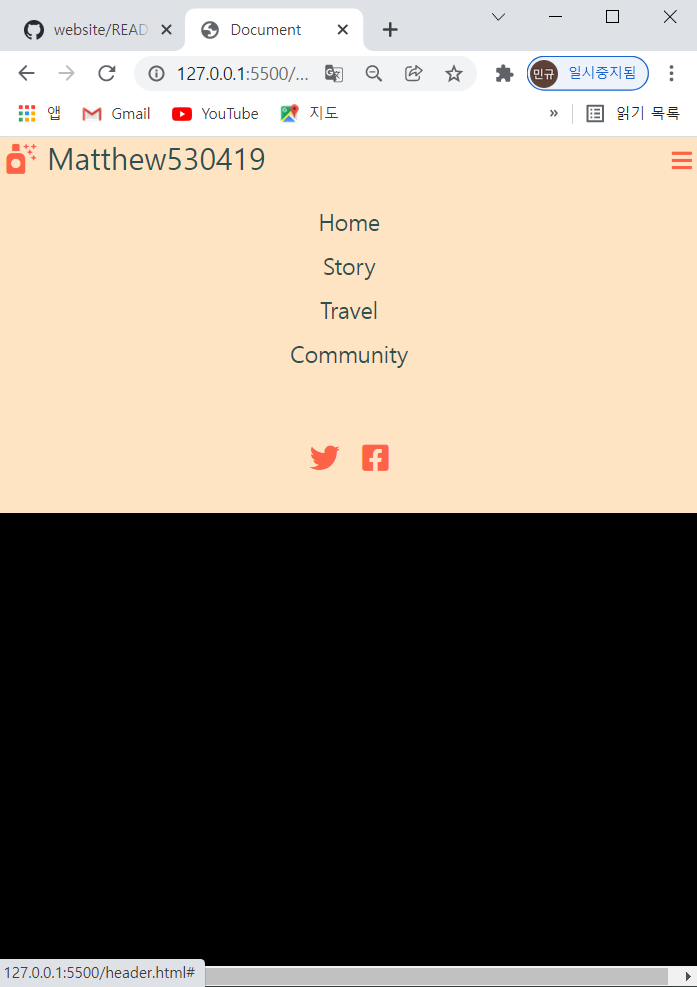

### 1. Project name: Creating website

### 2. Period : 1 day

### 3. Creating header

#### 3-1. HTML file

- Add kit URL on tag of head to use icons from website of font awesome as below.
  ``

- Add div with class so that box to header is assigned at first, and then, add other divs or unorder list with class and list so that assigned areas are divided per subbox. The list would be used to add spaces between lists of subbox. The reason why use tag of anchor is to add link as below.

- `<body>`
  `
`
  `
`
  `<i class="fas fa-air-freshener"></i>`
  `<a href="#">Matthew530419</a>`
  `
`
  `<ul class="navbar__menu">`
  `<li><a href="">Home</a></li>`
  `<li><a href="">Story</a></li>`
  `<li><a href="">Travel</a></li>`
  `<li><a href="">Community</a></li>`
  `</ul>`
  `<ul class="navbar__icons">`
  `<li><i class="fab fa-twitter"></i></li>`
  `<li><i class="fab fa-facebook-square"></i></li>`
  `</ul>`
  `
`
  `</body>`

- In case of all codes, Please refer file named `header.html`.

#### 3-2. CSS file

- Flex box is used on div with class named navbar to align subboxs. Use `justify-conent: space-between` to put each subbox at equal intervals on main axis. Use `align-items: center;` to align center on opposite axis. Use anchor to reference URL with clicking mouse. Use `text-decoration: none` to remove underbar of content. `padding` is more useful than `margin` to get space between lists. In case you want to mark whole space as much as div box, use function named `.class li:hover` when putting mouse cursor on the content.

- `.navbar` {
  display: flex;
  justify-content: space-between;
  background-color: bisque;
  align-items: center;
  padding-left: 0px;
  }

- .`navbar__menu` {
  display: flex;
  list-style: none;
  padding-left: 0px;
  font-size: 24px;
  }
  `.navbar__menu li` {
  padding: 8px 12px;
  }
  `.navbar__menu li:hover` {
  background-color: lightsalmon;
  border-radius: 4px;
  }

- In case you want to place different layout at certain width such as 768px, use media query named `@media screen and (max-width: 768)`.

- `@media screen and (max-width: 768px)` {
  .navbar {
  flex-direction: column;
  align-items: flex-start;
  }
  `.navbar__menu` {
  flex-direction: column;
  align-items: center;
  width: 100%;
  }
  `.navbar__menu li` {
  text-align: center;
  width: 100%;
  }

- In case you want to display certain icon when 768px width, use not only `display: block` on function in @media query but also `display: none` on function with same name outside media query.

- `.navbar__toggleBtn` {
  display: none;
  position: absolute;
  font-size: 24px;
  color: tomato;
  right: 8px;
  margin-top: 8px;
  }
  `@media screen and (max-width: 768px)` {
  `.navbar__toggleBtn` {
  display: block;
  }
  }

- In case of all codes, Please refer file named `style.css`.

#### 6-3. Javascript file

- In case you want to display some of menu or icon when clicking the button, use `document.querySelector('class')`, `eventtarget.addEventListener`, `element.classList.toggle(active)` with javascript. `querySelector` and `addEventListener` help operate something when clicking mouse. `classList.toggle` help to not only remove token when the token exist but also to add token when the token does not exist. It seems like automatic switch button.

- `const toggleBtn` = `document.querySelector('.navbar__toggleBtn');`
  `const menu` = `document.querySelector('.navbar__menu');`
  `const icons` = `document.querySelector('.navbar__icons');`
  `toggleBtn.addEventListener`('click', () => {
  `menu.classList.toggle('active');`
  `icons.classList.toggle('active');`
  })

- In case of all codes, Please refer file named `main.js`.

#### 6-4. Output

